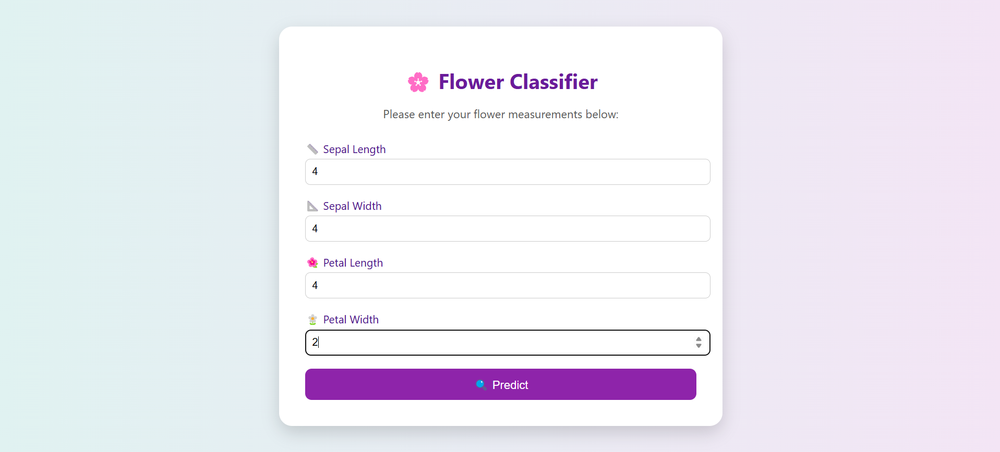
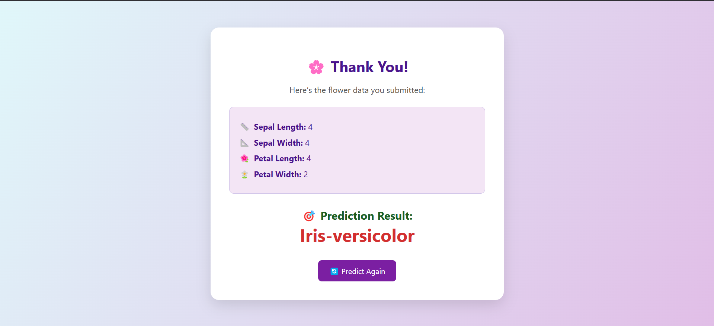

# 🌸 Iris Flower Classification - Flask App Deployment

This is a simple Iris flower classification model deployment project using a Flask web app.

The app accepts four flower measurements as input and returns the predicted Iris species (Setosa, Versicolor, Virginica) using a machine learning model.

---
### 🔡 Input Web UI



---

### 📊 Prediction Output




## 🚀 Run on Docker (No Build Required)

```bash
docker run --rm -d -p 8080:8080 your-dockerhub-username/flask-iris:latest
```

Then open your browser and visit:

```
http://localhost:8080/
```

---

## 🛠️ Build & Run Locally with Docker

1. **Clone the repository**

```bash
git clone https://github.com/yourusername/iris-flask-app.git
cd iris-flask-app
```

2. **Build the Docker image**

```bash
docker build -t iris_flask_app:1.0 .
```

3. **Run the Docker container**

```bash
docker run --rm --name iris_app -p 8080:8080 -d iris_flask_app:1.0
```

4. **Access the app**

```
http://localhost:8080/
```

---

## ☸️ Run on Kubernetes / OpenShift

- You can deploy this model/app using a Kubernetes **Deployment** object with a `LoadBalancer` or `NodePort` service.
- On OpenShift, simply use the Git URL with the build menu and OpenShift will automatically deploy your app.

---

## 🌐 App Interface

### 🔡 Input Web UI

The user-friendly form accepts four measurements:

- Sepal Length  
- Sepal Width  
- Petal Length  
- Petal Width  

🖼️ **Preview:**


---

### 📊 Prediction Output

The result includes:

- A summary of the inputs
- The predicted flower type in vibrant, color-coded text

🖼️ **Preview:**


---

## 🤖 Model Info

- **Model Used**: Scikit-learn based classifier (e.g., RandomForest or Logistic Regression)
- **Dataset**: [Iris Dataset (UCI)](https://archive.ics.uci.edu/ml/datasets/iris)

---

## 🧠 Want to Customize?

You can edit the HTML and styles under the `templates/` folder to match your own branding, color scheme, or add animations 🌈.

---

## 💬 Feedback

If you like this project or have any suggestions, feel free to open an issue or contribute via PR!

---

✨ Happy Predicting!
